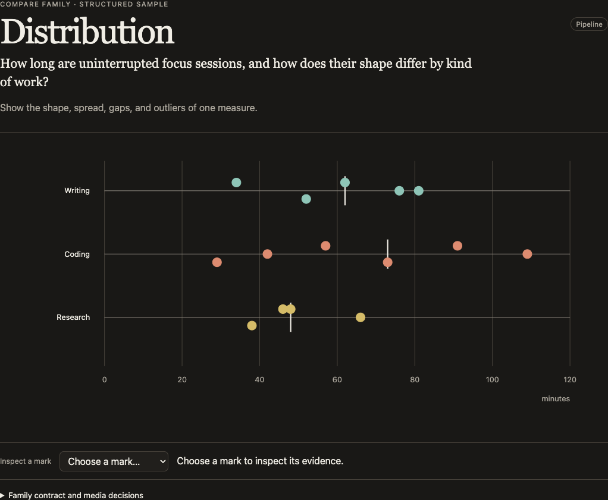
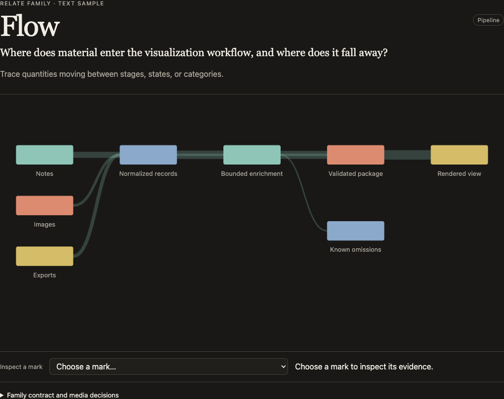
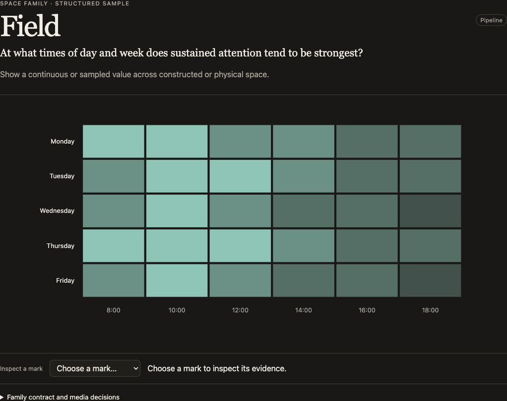
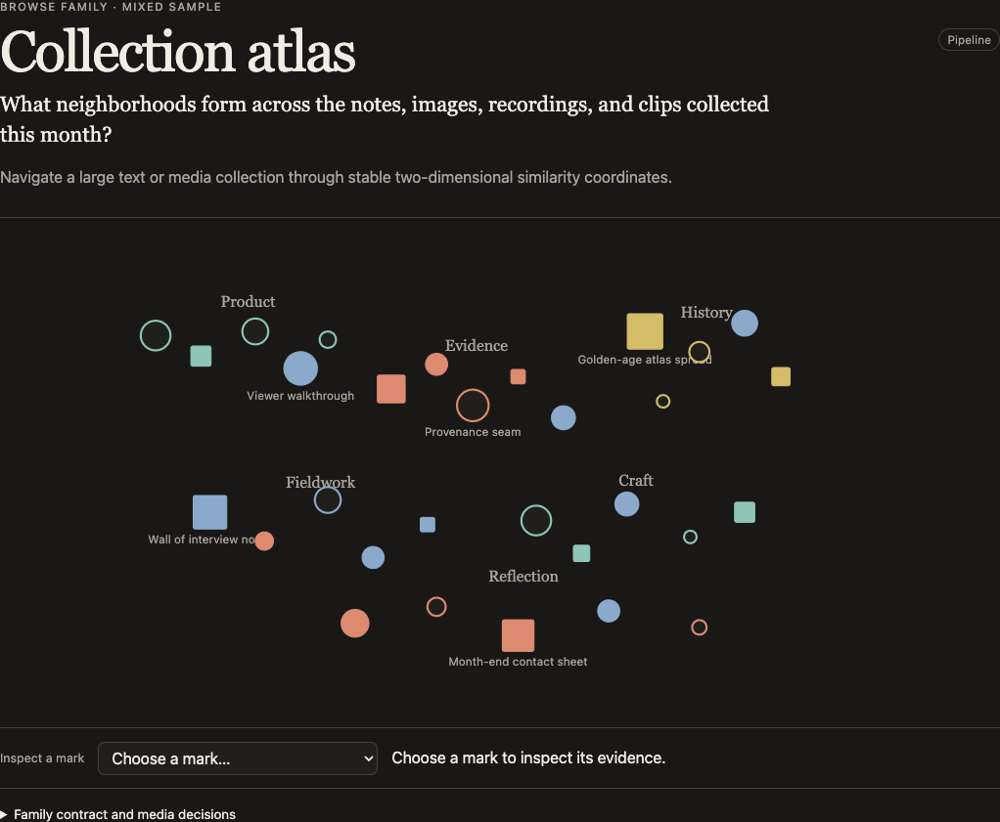

# Attend

Attend gives coding agents a governed way to look for relationships and patterns in evidence you authorize, test them as visual hypotheses, and point out what may deserve your attention. It keeps every attempted experiment in one traceable inbox and renders the results in a private local workspace with selection-aware chat.

**New here? Read [Getting started](docs/getting-started.md) first.** It is written for the person installing Attend rather than for the agent running it, and it covers what Attend is for, what a first week looks like, which questions are worth asking it, and what it will not do yet.

Attend runs entirely on your machine. It reads the files you point it at, never edits them, and uploads nothing. The default chat is a local `gpt-oss-20b` process with no credentials, no project path, and no network access. There is no Attend account and no telemetry.

## Install with a coding agent

Open the repository where you want Attend to work. Paste this prompt into your coding agent:

```text
Install Attend and set it up for this repository.

You may install Attend globally, add its setup files to this repository, install llama.cpp with Homebrew if needed, and download the roughly 12 GB local model. Stay in this repository. Do not upload its files or use sudo.

Attend needs macOS or Linux, Node.js 22 or newer, and npm. If anything is missing, stop and tell me. On macOS, if `llama-server` is missing and Homebrew is available, run `brew install llama.cpp`.

Run `npm install --global @siunami/attend@0.6.0`. If npm cannot install globally without sudo, install Attend under my user account instead. Then run `attend bootstrap --yes` and show me the output. You may retry it after an interrupted download. Drive the setup yourself; I'll only step in for a macOS approval.

Keep any existing Attend chat choice. For a new setup, use Attend's private local chat. Do not sign in to Codex or Claude for Attend. If installation or setup fails, show me the actual error. When Attend is ready, show me its welcome and installed version.
```

`bootstrap` owns the setup and health checks. A successful command means that Attend configured the repository, installed the local model when needed, and verified the installed files and chat route.

## Install from a terminal

Attend requires macOS or Linux, Node.js 22 or newer, npm, and llama.cpp's `llama-server`. The private `gpt-oss-20b` model needs roughly 12 GB of disk space. A machine with at least 24 GB of unified or system memory is recommended.

Run these commands from the repository where Attend will work:

```sh
npm install --global @siunami/attend@0.6.0
attend bootstrap --yes
```

If npm cannot write to its global install directory, use a directory owned by your account:

```sh
npm install --global --prefix "$HOME/.local" @siunami/attend@0.6.0
$HOME/.local/bin/attend bootstrap --yes
```

Inside an admitted Attend workflow, the host agent does not write chart code. It asks Attend for the installed Family Atlas catalog, selects an executable member for the analytic job, transforms source-backed facts into that member's declared roles, and submits a data-only request. Attend reopens the sources, verifies exact quotes, compiles a canonical package, resolves a fixed bundled renderer, and serves the result on loopback.

This release includes 34 executable forms across all 19 visualization families. The bundled Family Atlas catalog also retains 71 approved but not yet executable forms, one explicit capability abstention, and all 38 rejected forms. Annotated specimen remains `unavailable` until Attend can validate image-region coordinates and annotation provenance. Attend never falls back to another member or generates a substitute chart.

## What Attend can make

Every label and value in these screenshots is fabricated demo data. No user files, accounts, or private sources were used to make them.

| Distribution | Flow |
| --- | --- |
| [](docs/images/visual-gallery/distribution.png) | [](docs/images/visual-gallery/flow.png) |
| Reveal shape, spread, gaps, and outliers. | Trace movement, loss, and conversion through a process. |

| Field | Collection atlas |
| --- | --- |
| [](docs/images/visual-gallery/field.png) | [](docs/images/visual-gallery/collection-atlas.png) |
| Show intensity across time or space. | Browse a collection without flattening it into a single score. |

[Open the visual gallery](docs/visual-gallery.md) for six full-resolution examples suitable for a case study.

The Attend service handles sidebar questions with `gpt-oss-20b` by default. It owns the loopback page server, durable question queue, and llama.cpp process as one lifecycle. The page URL is not returned until the model is healthy, so a visible page has a working chat path without depending on a coding-agent listener. Codex CLI, Claude CLI, and host-agent routing remain explicit compatibility modes.

For development from a checkout, run these commands in the directory containing this README:

```sh
npm install --global .
attend bootstrap --yes --json
```

## Agent workflow

The installed `attend-visualize` skill has two lanes. Its primary lane proactively tests exploratory-data-analysis opportunities when the user did not request a visualization. Its requested lane handles an explicit visual form or interaction only when one executable Family Atlas member is an exact, natural match. If there is no exact match, Attend performs no setup, inspection, exploration, compilation, or view work. It returns control to the host agent's ordinary just-in-time visualization workflow, which can search the repository for an existing example or template and use its normal visualization tools.

An admitted Attend request follows this sequence:

```text
user question
  -> attend families --json
  -> exact executable family/member
  -> evidence-backed map request
  -> attend map request.json --json
  -> attend view --open --json
  -> local artifact + private gpt-oss-20b selected-mark chat
```

The skill also tells the active host agent to notice visual opportunities during ordinary work. At an eligible natural task boundary, it records one content-free `OpportunityCheck` with `attend checkpoint`: either `abstain`, which stays completely silent, or `proceed`, which authorizes one linked exploration. The check is limited to bounded, authorized evidence and a plausible comparison, distribution, change, relationship, hierarchy, network, location, or sequence. Attend hashes the raw host boundary identifier with a private project salt; it stores no prompt, transcript, source body, quote, path, host ticket, credential, or free-form rationale.

The agent proceeds only when a governed executable family can test a named pre-result hypothesis against a named baseline and the likely value exceeds the interruption cost. The CLI records the decision; it does not call a model, choose a family, open a browser, create an experiment, or alter the current visualization. A stable host boundary identifier makes exact retries and one-check-per-turn enforcement hard guarantees. Without one, the one-check limit remains managed-skill policy measured by the evaluation harness.

For a direct visualization, the agent presents the artifact in a one-column Markdown card so the link remains clickable:

| Attend visualization |
| --- |
| **[Open the visualization](VIEWER_URL)** |
| **Why it matters**<br>How the view relates to the current goal. |
| **What surfaced**<br>The evidence-backed insight or clearly labeled exploratory signal. |

## Experiment inbox contract

The packaged skill also defines the experiment-inbox workflow. The agent admits only hypotheses tied to the current task. It records every admitted hypothesis before execution and runs every admitted experiment. Every outcome remains in one canonical experiment inbox, including interesting, uninteresting, null, inconclusive, invalid, and failed attempts. Promotion may emphasize any number of interesting results, but it never copies a result into another section. Agent promotion, a human star, and structured feedback remain separate signals.

Each plan records its versioned representation intent, authorized source scope, named comparison baseline, exploratory or confirmatory status, and comparison count. A change of variables, representation, or question creates a child experiment linked to its parent. The earlier plan remains unchanged. Agent chat mentions at most one result at a natural task boundary and links the experiment workspace; the workspace keeps the complete trail.

Human-readable experiment plans and event prose are visible in the capability-protected loopback workspace. They should summarize findings, not contain credentials, raw source bodies, exact source quotes, absolute paths, prompts, or transcripts. Attend records a generic workspace diagnostic for a staged execution failure while leaving the detailed error in the invoking command's private output.

The lifecycle is explicit:

```text
attend checkpoint <request.json> --json
attend inspect <request.json> --json
attend explore <request.json> --json
attend map <request.json> --stage --exploration <id> --experiment <id> --json
attend assess <experiment-id> <assessment.json> --json
attend promote <experiment-id> [--rationale <text>] --json
attend feedback <experiment-id> --kind <reason> [--note <text>] --json
attend workspace [exploration-id] --open --json
```

`checkpoint` records the active agent's silent boundary decision without reading the evidence set. `inspect` reports deterministic source shape without returning source text. `explore` commits the immutable pre-result plans; a proactive request includes the proceeding checkpoint's `checkpointId`, while a user-invoked exploration may omit it. Staged `map` attempts leave the ordinary current artifact unchanged, including when compilation fails. `assess` records outcome, evidence strength, transformations, omissions, limitations, and the eight-part interestingness vector. `promote` makes an interesting completed artifact current without creating another experiment. `workspace` opens the complete canonical trail. Direct `attend map` and `attend view` remain available for a single visualization.

When a better view needs a new private source, the agent must name the improvement, the source, and the smallest required scope before it reads anything. It asks for permission in the conversation before triggering an operating-system prompt, then queries only the records needed for the stated join. Existing system access is not task authorization. If the user declines or access fails, the agent continues with the original evidence and leaves unresolved values visible.

`attend view --open --json` returns the local artifact URL only after both the private model and page server are healthy. If the system browser cannot open automatically, `browser.opened` is false and `browser.warning` tells the agent to open `viewerUrl` manually. Chat remains available because the model belongs to the same Attend service, not to the agent that opened the browser.

The family is chosen by the question, not by visual taste:

- Compare: rank, distribution, composition, profile, passage comparison
- Time: trend, timeline, sequence
- Relate: relationship, matrix, hierarchy, network, flow, mechanism
- Space: region map, point map, field
- Browse: annotated specimen, collection atlas

Run `attend families --json` for each governed member, required roles, field types, structured requirements, availability, abstention guidance, and the documented and rejected alternatives.

## Map request contract

`attend map` accepts one declarative JSON request. For example:

```json
{
  "version": 3,
  "question": "How do results differ by region?",
  "family": "rank",
  "member": "bar-list",
  "representationIntent": {
    "version": 1,
    "mode": "open",
    "constraints": []
  },
  "input": {
    "adapter": "evidenced-records-v1",
    "sources": [
      { "path": "notes/results.md", "textProjection": "utf8" }
    ],
    "records": [
      { "key": "north", "label": "North", "value": 42 },
      { "key": "south", "label": "South", "value": 31 },
      { "key": "east", "label": "East", "value": 27 }
    ],
    "evidence": [
      {
        "source": { "path": "notes/results.md", "textProjection": "utf8" },
        "quote": "North: 42",
        "recordKey": "north",
        "field": "label"
      },
      {
        "source": { "path": "notes/results.md", "textProjection": "utf8" },
        "quote": "North: 42",
        "recordKey": "north",
        "field": "value"
      },
      {
        "source": { "path": "notes/results.md", "textProjection": "utf8" },
        "quote": "South: 31",
        "recordKey": "south",
        "field": "label"
      },
      {
        "source": { "path": "notes/results.md", "textProjection": "utf8" },
        "quote": "South: 31",
        "recordKey": "south",
        "field": "value"
      },
      {
        "source": { "path": "notes/results.md", "textProjection": "utf8" },
        "quote": "East: 27",
        "recordKey": "east",
        "field": "label"
      },
      {
        "source": { "path": "notes/results.md", "textProjection": "utf8" },
        "quote": "East: 27",
        "recordKey": "east",
        "field": "value"
      }
    ]
  },
  "options": { "title": "Results by region" }
}
```

Then compile and open it:

```sh
attend map request.json --json
attend view --open --json
```

`question` is required and carries the user's literal question into the compiled artifact. `options.title` is an optional display label; it does not replace or rewrite the question. Version 3 requires `representationIntent` and a discriminated `input.adapter`. `evidenced-records-v1` contains the existing sources, records, and quote evidence. `local-image-set-v1` accepts only `{ "adapter": "local-image-set-v1", "directory": "relative/path" }` and is valid only for `collection-atlas/contact-atlas`. Version 2 text requests remain supported without the `input` wrapper; version 1 remains the open-intent compatibility boundary.

`open` means the user did not constrain the visual form. The host chooses among forms whose hard requirements pass by reading each form's `preferWhen`, `preferOver`, `avoidWhen`, and abstention guidance. `exact` carries one finite constraint for each named `form`, `dimensionality`, `interaction`, `motion`, or `projection`. An incompatible version-3 exact request fails with `INELIGIBLE_REQUESTED_FORM`; Attend does not substitute another form. Version 2 retains its historical error codes while still failing without substitution.

The invocation determines the project root. A request cannot supply or enlarge it. Source paths must resolve inside that root. Text forms support explicit UTF-8 and normalized-text projections. Contact atlas accepts one directory containing 12–200 verified JPEG files with camera `DateTimeOriginal`; it rejects symlinks, path traversal, malformed or changed files, missing capture times, unsupported media, oversized images, and overlarge sets.

For `evidenced-records-v1`, every required field in every record needs at least one exact source quote. If a quote occurs more than once, the claim must include its one-based `occurrence`. Contact-atlas roles instead derive from verified JPEG metadata and whole-file evidence. Attend derives file hashes, stable source and record identifiers, locators, mark IDs, package hashes, and the catalog renderer receipt. Requests cannot provide renderer modules, asset URLs, hashes, locators, source bodies, or executable code.

The compiler rejects unknown families, unavailable or non-executable members, missing roles, invalid types, unsupported media, ambiguous or absent quotes, geographic values outside valid bounds, malformed graph shapes, incomplete grids, hierarchy errors, and family-specific size violations. It validates and stages the public package and private evidence store before updating `current.json`, so a failed request leaves the prior current artifact intact.

The canonical package stored on the local machine includes source-integrity receipts such as stable IDs, display paths, and hashes, but no source bodies or private evidence claims. The package projection sent to the browser contains only the fields needed to draw the view, the visible role values, and opaque evidence IDs; it omits source metadata, provenance, locators, record IDs, source bodies, and private quote claims. A visible role such as a passage may intentionally contain source-derived text when that text is the designed mark. Private source snapshots and evidence linkage are hash-bound, gitignored, and available only through the local evidence boundary.

## Artifact view and chat

`attend view` starts or reuses a detached loopback-only service, starts and health-checks `gpt-oss-20b`, starts the page server, prints the project `libraryUrl` and current `viewerUrl`, then exits. The library URL remains stable across new artifacts and stop/start cycles. Each saved artifact has its own session URL. The model endpoint is also loopback-only and is not exposed to the browser; the Attend service is its only client.

The production viewer consumes a closed projection of the canonical package emitted by `attend map`. It resolves that package through the installed catalog and the fixed renderer assigned to its executable member. The package and browser cannot choose a module or remote asset. Direct observations use canonical package mark IDs; visible aggregates use form-governed target IDs whose membership the server recomputes.

Below every visualization is a Data panel listing the underlying rows with their label, field values, and evidence count. Clicking a point, component, or aggregate, or clicking a row, filters that list to exactly the records the selection stands for and highlights the clicked element. Clicking the selected element again, or choosing Show all, restores the full list. Large datasets list the first 100 rows with an explicit total. Nothing is revealed on hover, and no interaction changes the height of the surface being interacted with.

Selecting a mark updates server-owned, revisioned state. For a visible aggregate, the browser sends only its governed target ID; the server recomputes membership, verifies its count and hash, and paginates the complete evidence set. Chat receives a bounded preview plus the explicit omission count. A selection attaches to the next sidebar question, and later messages inherit the latest relevant attachment until the user selects a new visual topic. Selecting does not open the chat drawer; the Ask control or `Cmd`+`/` does.

Private local chat is the default. Attend sends only the bounded question packet, selected visual context, recent Attend turns, and implicated evidence to `gpt-oss-20b`. The inference subprocess starts with llama.cpp offline mode, receives no provider credentials, has no project path or tools, and makes no hosted inference call. If the service is interrupted during an answer, the durable local job is queued again on restart.

Host-attached chat remains available as an explicit compatibility mode. Select it before opening the view:

```sh
attend chat route host --json
attend view --open --json
```

The active coding agent then runs the wait command returned by `view`:

```sh
attend chat wait --ticket <ticket-from-view> --timeout 300 --json
```

Agents with a local MCP configuration can run the same bridge with `attend mcp --root <project-root>`. It exposes only `attend_wait_for_question`, `attend_rebind_question`, and `attend_reply`; the server is fixed to that project root and delegates to the same durable queue and reply guards. Pass the `view` ticket to `attend_wait_for_question`, then pass the returned `replyGuard` unchanged to `attend_reply`. The MCP façade does not add a model provider or a second evidence path.

The command returns one verified `attend-host-question/1` packet with the stored question, immutable selection, visual-context binding, bounded prior Attend turns, implicated evidence, and `replyGuard`. It does not scan for more evidence. Answer only from that packet, then pass the ticket and every command-line guard back to Attend:

```sh
attend reply \
  --ticket <ticket-from-view> \
  --question-id <replyGuard.questionId> \
  --expected-revision <replyGuard.expectedRevision> \
  --selection-id <replyGuard.selectionId> \
  --message-stdin \
  --json
```

Send the answer on the command's stdin and close stdin. Do not interpolate evidence-derived answer text into a shell command. The reply input is bounded to 64 KiB.

The ticket binds and verifies `replyGuard.sessionId`. Revision and selection checks prevent an answer from being attached to changed visual state. A wait leaves the durable question queued. While Attend builds the packet it advertises a live listener; after delivery it advertises a bounded `delivered` reservation rather than claiming the agent is still active. If the wait times out or the agent stops, the question remains queued. The agent can re-run the wait with the same unexpired ticket, but Attend cannot resume or wake an inactive agent conversation.

Opening the same artifact from a replacement agent may return `chat.recovery`. If the earlier agent is actively listening, takeover is unavailable. If the packet was delivered or no live listener remains, Attend reports an explicit `chat rebind --take-over` command. Run it only with the user's approval: it atomically moves that one queued host question to the new ticket, preserves the frozen selection and evidence, and revokes the earlier attachment's reply guard. The MCP equivalent is `attend_rebind_question` with `confirmTakeover: true`.

While the agent is actively collaborating on the artifact, it re-arms `attend chat wait` after each reply. On timeout, it tells the user that the listener ended instead of claiming that chat is still connected.

In host mode, Attend itself makes no model-provider call. The bounded evidence packet enters the active coding agent's tool context, so its contents follow that agent's configured model and provider route. The viewer, session, and private evidence store stay on the local machine. Attend has no hosted account or telemetry.

Detached responders are opt-in fallbacks:

```sh
attend chat route codex --json
attend chat route claude --json
```

Each command labels and selects an isolated Codex CLI or Claude CLI worker for future questions. Run `attend view --open --json` again after choosing a route. Attend snapshots the route when it saves each question and never switches providers automatically. A detached worker receives the same bounded question packet through its selected provider route. It receives no project path and cannot use project tools.

Return to private local chat with `attend chat route local --json`. Use `attend doctor --json` to check the model receipt and core visualization readiness. Pass `--adapter codex` or `--adapter claude` only when you want to probe an optional detached provider.

## Phrase recurrence shortcut

The original deterministic phrase analysis remains as a specialized shortcut:

```sh
attend phrases notes/ \
  --question "Which phrases recur across these notes?" \
  --target "Project notes" \
  --json
attend view --open --json
```

It accepts `.md`, `.mdx`, `.txt`, and normalized `.jsonl` sources. By default, a phrase must occur at least twice across at least two distinct sources, and distinct-source breadth ranks before raw repetition. Use `--min-sources 1` only when repetition inside one source is intentional. Do not use this shortcut for a different analytic job.

## Context and manual notes

Use `attend context` when the user asks the current agent to inspect a click, troubleshoot state, or recover an answer outside the normal host wait loop:

```sh
attend context --json
attend context --include-excerpts --json
```

`attend context` returns the exact current or oldest unanswered historical selection with its package ID, view revision, mark IDs, and evidence links. It omits excerpts by default because command output enters the current coding agent's context. Included excerpts follow that agent's configured model and provider route.

To save a manual response to a non-host pending question:

```sh
attend reply \
  --question-id <pendingQuestion.id> \
  --expected-revision <pendingQuestion.viewState.revision> \
  --selection-id <pendingQuestion.selection.id> \
  --message-stdin
```

The revision prevents concurrent overwrites. The immutable selection ID prevents an answer to one mark from being attached to another.

## Commands

- `attend setup [--agent <agents|claude>]... [--dry-run] [--json]` configures the project and managed skill. Without `--agent`, it installs both targets.
- `attend model install [--timeout <minutes>] [--json]` downloads and successfully loads the fixed `gpt-oss-20b` GGUF through llama.cpp.
- `attend families [--json]` returns the governed Atlas catalog.
- `attend checkpoint <request.json> [--json]` records one content-free `abstain` or `proceed` decision without starting analysis or UI work.
- `attend inspect <request.json> [--json]` returns deterministic source-shape observations without source text.
- `attend explore <request.json> [--json]` creates or extends an immutable experiment plan ledger.
- `attend map <request.json> [--json]` verifies sources and compiles a canonical Atlas artifact.
- `attend map <request.json> --stage --exploration <id> [--experiment <id>] [--json]` records one admitted execution without changing the current artifact.
- `attend assess <experiment-id> <assessment.json> [--json]` records the post-result assessment and interestingness vector.
- `attend promote <experiment-id> [--rationale <text>] [--json]` promotes in place and makes the artifact current.
- `attend feedback <experiment-id> --kind <reason> [--note <text>] [--json]` records a distinct human signal.
- `attend workspace [exploration-id] [--open] [--json]` opens the canonical experiment inbox.
- `attend phrases <paths...> --question <text> [options]` runs the specialized recurrence analyzer.
- `attend view [--port 0] [--open] [--json]` starts or reuses the model-backed local artifact library.
- `attend status [--json]` reports the service and stable URLs.
- `attend stop [--json]` stops the service without deleting artifacts or configuration.
- `attend chat route [local|host|codex|claude] [--json]` reads or explicitly changes the route for future questions. `local` is the default.
- `attend chat wait --ticket <host-ticket> [--timeout <seconds>] [--json]` waits for one attachment-bound question packet.
- `attend chat rebind --take-over ...` explicitly moves one queued host question to a replacement ticket after user approval.
- `attend mcp [--root <path>]` exposes the same attachment-bound wait, takeover, and reply bridge as three stdio MCP tools.
- `attend context [--include-excerpts] [--json]` reads exact visual and pending-question state.
- `attend reply ...` commits a guarded host answer or manual note; agents should pass answers with `--message-stdin` or the structured MCP tool.
- `attend doctor [--adapter <codex|claude>] [--json]` reports core visualization, local-model, host-bridge, selected-route, and optional detached-provider readiness separately.

Run `attend <command> --help` for all options and request-shape guidance.

## Local state

Shared configuration lives at `.attend/project.json`. Inspection receipts, derived packages, private evidence, sessions, conversations, explorations, experiment events, service identity, host attachment ticket digests, chat route, and the current pointer live below gitignored `.attend/local/`. Attend never persists the raw host ticket. The managed skill is installed at `.agents/skills/attend-visualize/SKILL.md` and `.claude/skills/attend-visualize/SKILL.md` unless setup is restricted with `--agent`; the Agents installation also receives its managed `agents/openai.yaml` discovery metadata.

Attend reads source files but does not edit them. It does not scan paths that were not supplied, upload a corpus to an Attend service, watch files, or silently choose another visualization implementation. Regenerate an artifact from its explicit request when sources change; do not hand-edit packages or evidence stores.

## Verify

```sh
npm run verify
```

The verification suite covers all 34 executable forms in the 19-family catalog, the explicit specimen abstention, exact evidence and hash checks, fixed package-native renderer contracts, direct and aggregate selection, private evidence hydration, the attachment-bound host loop, explicit detached adapters, idempotent cross-agent setup, and loopback service lifecycle. It also builds and extracts the release tarball, starts its viewer without `node_modules`, checks the published module graph, and drives every executable form through the live browser matrix at desktop and mobile widths.

## License

Attend is available under the [MIT License](LICENSE). Bundled browser assets retain the separate licenses listed in [the third-party notices](viewer/vendor/THIRD_PARTY_NOTICES.md).
