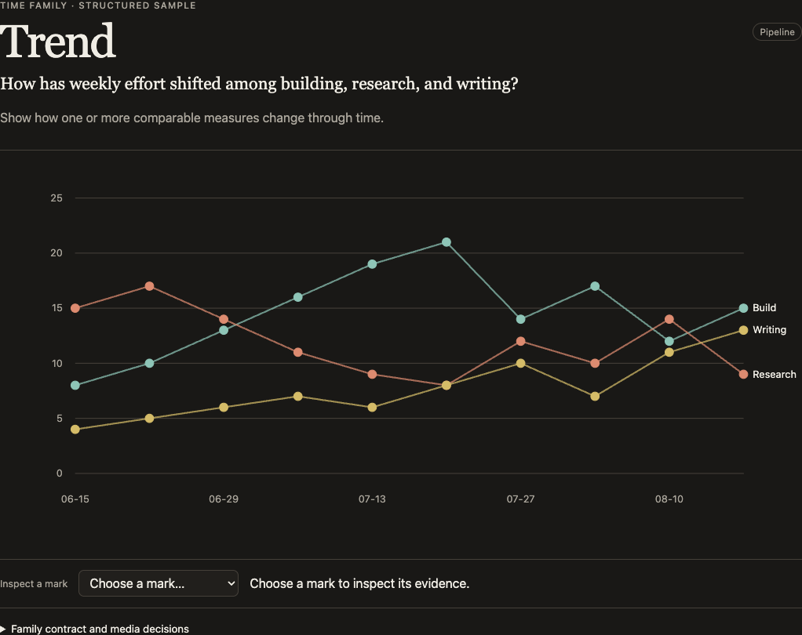
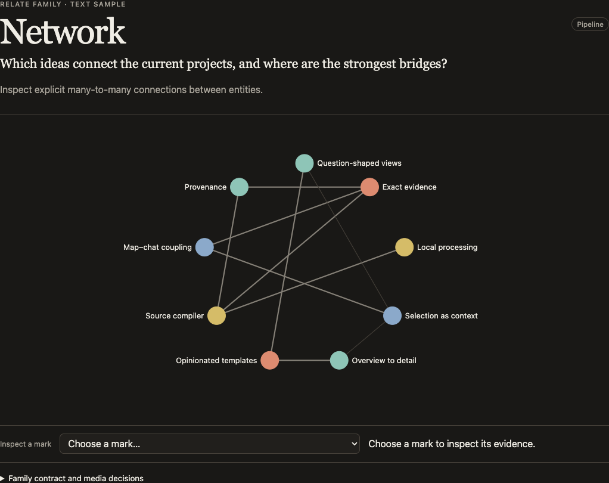

# Attend visual gallery

Every label and value in these screenshots is fabricated demo data. No user files, accounts, or private sources were used to make them. The images can be used as full-resolution case-study figures.

Select any image to open its full-resolution PNG.

## Distribution

Reveal shape, spread, gaps, and outliers in a measure.

## Trend

Show how a measure changes over time and make turning points visible.

## Network

Inspect connections and identify the strongest bridges between entities.

## Flow

Trace movement, loss, and conversion through a process.

## Field

Show intensity across constructed space, such as weekdays and times.

## Collection atlas

Browse a collection without flattening it into a single score.

